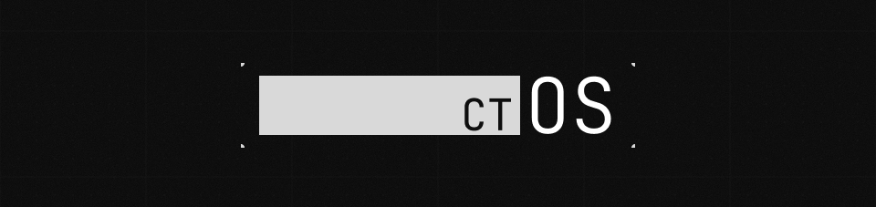

<div align="center">
  

  <h1>ctOS</h1>
  <p>A highly-optimized, immersive Watch Dogs-inspired Wayland desktop environment built natively for NixOS.</p>

  <p>
    
    
    
    
  </p>
</div>

---

## // OVERVIEW

ctOS is a complete, declarative NixOS flake that provisions a hyper-lean, visually immersive desktop experience inspired by the Watch Dogs universe. 

Instead of relying on bloated desktop environments or a mishmash of uncoordinated shell scripts, ctOS uses a completely bespoke graphical shell written in **QML / Quickshell**. It features native Wayland integrations, dynamic tiling compositors, and aggressive performance optimizations.

### // KEY FEATURES

- `[+]` **Custom Quickshell Desktop** — Includes a massive `SystemRail` for hardware/session controls, an `AmbientBar`, and an instantaneous `CommandDeck` runner.
- `[+]` **Immersive Greetd Login** — A fully custom graphical login screen featuring a hacker boot sequence and glitch shaders.
- `[+]` **Wayland Compositors** — Highly-tuned, modular integrations for both **Hyprland** and **Niri**.
- `[+]` **Performance Optimized** — The QML shell is heavily optimized: surfaces are kept in RAM, Javascript search models are pre-computed, and aggressive background logging is disabled for a snappy UX.
- `[+]` **GRUB DedSec Theme** — Native NixOS GRUB bootloader integration sporting the DedSec theme.
- `[+]` **Modular Flake Architecture** — Every component (audio, bluetooth, gaming, AI/ML) is isolated in `modules/features/` and can be toggled via `ctos.<domain>.<feature>.enable`.

---

## // QUICK START

### [INSTALLATION]

Clone the repository and build your host configuration. By default, the `Makima` host serves as the primary desktop blueprint.

```bash
git clone https://github.com/reze-dev/ctOS ~/.config/ctOS
cd ~/.config/ctOS

# Build and apply the configuration
sudo nixos-rebuild switch --flake .#Makima
```

> **Note:** Make sure you have Nix flakes and experimental features enabled on your system.

### [DEBUGGING]

The system is configured to run silently to save CPU cycles and I/O. If you are developing or modifying the shell and need to trace errors, you can enable the global debug toggle in your host config (`hosts/Makima/default.nix`):

```nix
ctos.debug.enable = true;
```
This restores verbose compositor logs, QML debug output, and routes them to `/tmp/ctos-desktop-session.log` and `/tmp/ctos-greeter.log`.

---

## // ARCHITECTURE

```text
ctOS/
├── flake.nix                  # Flake entry point
├── flake/                     # Core flake-parts (hosts, checks, devshell, formatter)
│
├── hosts/                     # Machine-specific configurations
│   ├── common.nix             # Shared system baseline
│   └── Makima/                # Example primary host
│
├── modules/features/          # Isolated, toggle-able system features
│   ├── core/                  # Boot (GRUB), networking, fonts, secrets
│   ├── desktop/               # Hyprland, Niri, Audio, Gaming, Browsers, Greetd
│   ├── development/           # AI/ML, DevTools, Emacs
│   ├── shell/                 # CLI shell config (Fish, Starship)
│   └── terminals/             # Kitty, Ghostty
│
├── shell/                     # The ctOS Quickshell Desktop Environment
│   ├── desktop/               # QML Surfaces (CommandDeck, SystemRail, AmbientBar)
│   ├── greeter/               # Custom Greetd login screen
│   └── common/                # Shared QML singletons, loggers, and services
│
└── assets/                    # GRUB themes, Plymouth splashes, SVG iconography
```

---

## // COMPOSABLE PROFILES

Features are grouped into profiles for easy host configuration:

| Profile | Description |
| :--- | :--- |
| **Base** | Minimal system (boot, networking, SSH, neovim, shells, fonts, locales) — always enabled |
| **Desktop** | Full Wayland graphical environment (Hyprland, Niri, Audio, ctOS Shell) |
| **Workstation** | Developer tools, AI/ML, containers, virtualization |
| **Gaming** | Steam, Gamemode, Gamescope, MangoHud, Wine/Proton |

---

## // LICENSE
This project is licensed under the [MIT License](LICENSE).
