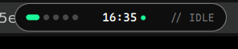
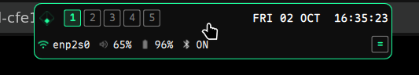
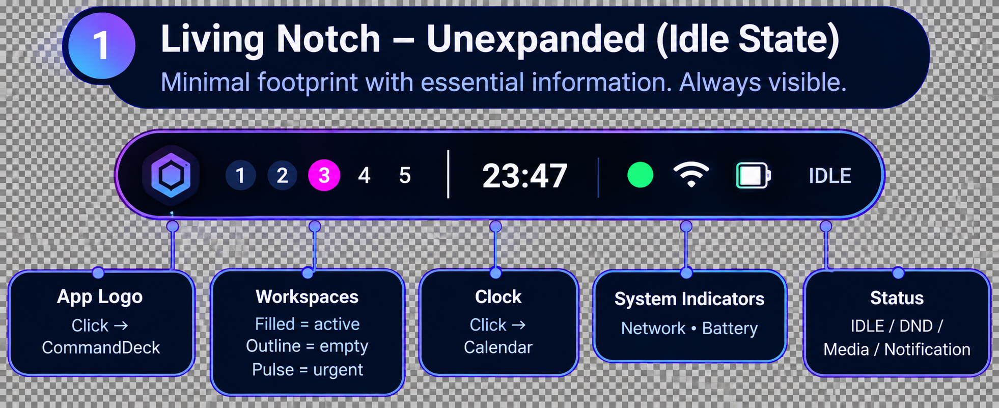
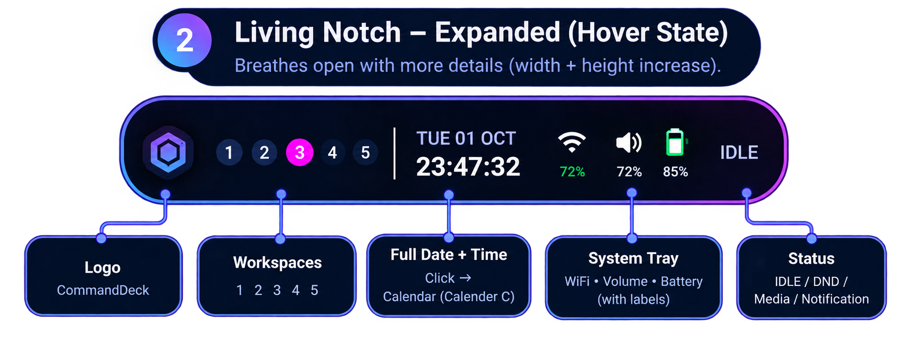
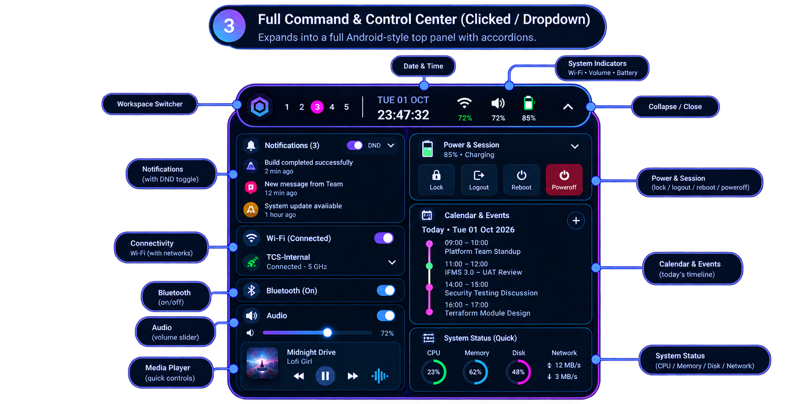
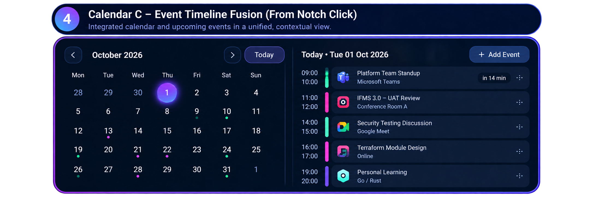

# Neon Living Notch — Target Specification

**Status:** authoritative. This document supersedes all prior shell design documents.

**Source of truth:** the four reference images in `images/`. Where prose and image
disagree, the image wins. Where an image is ambiguous, this document states the
chosen interpretation explicitly rather than leaving it open.

**Supersedes:** the former `shell/docs/design/dynamic-island-event-log-morph.md`,
`shell/docs/hardcoded_offsets_analysis.md`, and the retired `migration/` planning
set (`living-notch-target.md`, `Implementation guidelines for Living notch.pdf`).

---

## 0. Baseline — where the shell is today




The shipped shell is **green-on-graphite**: accent `#1BFD9C` on a neutral
`#0E0E0E`–`#CACACA` grayscale ramp, danger `#FC3E38`. The active workspace is
green. The target replaces this with a **navy-and-neon** identity where green is
demoted to a *status* role only and magenta becomes the attention/accent role.

Geometry of the current notch already matches the target idle state (220 × 30)
and expanded height (60). Expanded **width** is 380 in code and must become 320.

---

## 1. Section 1 — Unexpanded (Idle) Notch



A single centered stadium-shaped pill, floating at the top of every output.

### Geometry

| Property | Value |
| --- | --- |
| Width | 220 px |
| Height | 30 px |
| Corner radius | `height / 2` (15 px) — fully rounded ends |
| Border | 2 px, horizontal gradient |
| Position | horizontally centered, anchored top |
| Reserved layout space | none (`exclusionMode: ExclusionMode.Ignore`) |

### Fill and border

- Fill: near-black navy, slightly translucent so wallpaper shows through.
- Border: 2 px gradient running **blue → violet → magenta** left to right.
- Outer glow: soft, matching the border gradient, strongest at the ends.
  Glow must not bloom far enough to be visible against a light wallpaper.

### Content order (single row)

| # | Element | Treatment |
| --- | --- | --- |
| 1 | Logo tile | ~28 px rounded-square, dark navy fill, subtle border. Contains a hexagon glyph with a blue→violet gradient. |
| 2 | Workspace indicators | 5 fixed slots. Inactive = dark navy filled circle, muted number. **Active = magenta filled circle**, white number. Urgent = pulse. |
| 3 | Separator | 1 px vertical rule, muted blue, ~30 % opacity |
| 4 | Clock | `HH:MM`, large, text-primary |
| 5 | Separator | as above |
| 6 | Network dot | solid green circle when connected; red when disconnected; absent when unavailable |
| 7 | Wi-Fi glyph | outline |
| 8 | Battery glyph | outline, green when charging |
| 9 | Status text | `IDLE` / `DND` / `MEDIA` / `NOTIFICATION`, muted, letterspaced uppercase |

### Interaction

| Target | Action |
| --- | --- |
| Logo | click → Command Deck (launcher/search) |
| Clock | click → Calendar C |
| Workspaces | click slot *n* → switch to workspace *n* |
| Anywhere else | hover → expand; click → Command & Control Center |
| Wheel | volume ±5 % |

### Required behaviour

- The notch is the **sole** top-level bar element. No other top-edge surface
  may exist.
- Nothing may be pushed down. The window must not reserve exclusive zone.
- The Wayland input region must track the pill exactly, at every size.

---

## 2. Section 2 — Expanded (Hover) Notch



Same pill, larger. Must read as the *same object breathing open*, never as a
different widget appearing.

### Geometry

| Property | Value |
| --- | --- |
| Width | 320 px |
| Height | 60 px |
| Corner radius | `height / 2` (30 px) |
| Border | 2 px, same gradient |

### Content

Row 1 (logo + workspaces, vertically centred) is unchanged from idle.

The remainder becomes a **two-row block**:

```
┌────────────────────────────────────────────────────────────┐
│ [logo]  1 2 3 4 5   │  TUE 01 OCT      ⌁     🔊     🔋     │
│                    │  23:47:32       72%    72%    85%   │
└────────────────────────────────────────────────────────────┘
```

- Date: uppercase, letterspaced, muted blue.
- Time: includes seconds, text-primary, larger than date.
- Wi-Fi glyph with percentage beneath. Percentage is **green** when connected.
- Volume glyph with percentage beneath, text-primary.
- Battery glyph with percentage beneath, text-primary.
- Status text retained at the trailing edge.

### Animation

Spring-driven on both axes. The pill must overshoot slightly and settle.

```qml
SpringAnimation {
    spring: 4
    damping: 0.3
    mass: 0.8
}
```

Requirements:

- Width, height, and corner radius interpolate together; no independent easing.
- Content opacity crossfades — no element may pop.
- Content must **not** be clipped during interpolation.
- `Settings.reducedMotion` collapses all durations to 0 and disables springs.
- Expansion is pinned while the CCC is open (see §3.4).

---

## 3. Section 3 — Adaptive Command & Control Center



### 3.1 Structure — one surface, not a panel

The CCC is the notch **unfolding downward**. The notch header remains visible at
the top of the CCC, showing logo, workspaces, date/time, indicators, and a
collapse chevron. Body content sits directly beneath, inside the same rounded,
gradient-bordered container.

```
┌────────────────────────────────────────────────┐
│  notch header  …………………………………………  ⌃      │  ← stays
├─────────────────────────┬──────────────────────┤
│ Notifications           │ Power & Session      │
│ Wi-Fi                   │ Calendar & Events    │
│ Bluetooth               │ System Status        │
│ Audio                   │                      │
└─────────────────────────┴──────────────────────┘
```

This continuity is the central design requirement. Two separately-positioned
layer-shell surfaces cannot achieve it: the compositor will insert a seam and the
border/glow cannot wrap continuously. **The CCC must therefore be hosted inside
the notch's own window, which grows downward.** See
`../design/architecture.md` § "Single-surface hosting" for the mechanism.

### 3.2 Geometry

| Property | Value |
| --- | --- |
| Width | 760 px, clamped to `min(760, screenWidth - 80)` |
| Columns | 2, equal width, 12 px gutter |
| Top edge | flush with the notch's bottom edge |
| Corner radius | matches the notch pill at the join; 16 px at the bottom |
| Height | **content-driven**. No fixed height anywhere. |

### 3.3 Sections

Each section is a card: 12 px radius (`Theme.commandCenterSectionRadius`),
`Theme.surfaceDeep` fill, 1 px `Theme.borderSubtle`, 12 px internal padding
(`Theme.cardPadding`).

| Section | Column | Header content | Body |
| --- | --- | --- | --- |
| Notifications | left | count, DND toggle, chevron | list of notification rows |
| Wi-Fi | left | state label, power toggle | connected network + network list |
| Bluetooth | left | state label, power toggle | paired + available devices |
| Audio | left | state label, power toggle | volume slider + media card |
| Power & Session | right | chevron; battery % and charge state as subtitle | 4 session buttons |
| Calendar & Events | right | `+` action button; date as subtitle | today's timeline |
| System Status | right | — | CPU / Memory / Disk / Network |

**Only one or two sections may be expanded at a time.** Expanded state is
single-selection; opening one collapses the other.

#### Notifications

Each row: app icon tile (rounded square, tinted by source), bold summary,
muted relative time. DND is a pill switch, blue when engaged. Urgency is shown
by the icon tile tint and a left edge stripe, never by changing the text colour.

#### Wi-Fi

Connected network gets a row with a green icon tile, network name in bold, and
`Connected · 5 GHz` muted beneath. Expansion reveals the full network list with
inline password entry.

#### Bluetooth

Compact when collapsed. Power toggle in the header. Body holds paired devices
then discovered devices.

#### Audio

- Volume slider: horizontal, gradient track (violet → blue), circular handle,
  percentage label at the trailing end.
- Media card: album art tile, track title bold, artist muted, transport row
  (previous / play-pause in a filled circle / next), plus a waveform glyph.
- Only one of output-volume and mic is shown at a time to keep the card compact.

#### Power & Session

Four equal tiles in a row: **Lock, Logout, Reboot, Poweroff**. Each is an icon
above a text label.

- Lock / Logout / Reboot: `--surface-deep` fill, subtle border.
- **Poweroff: `--danger` fill**, the strongest warning treatment in the shell.
- Reboot, Logout and Poweroff require inline destructive confirmation before
  execution. Lock does not.

#### Calendar & Events

Vertical timeline for the selected day.

```
 09:00     ┃  [icon] Platform Team Standup        ⋮
 10:00     ┃         Microsoft Teams     [in 14 min]
           ┃
 11:00     ┃  [icon] IFMS 3.0 – UAT Review        ⋮
 12:00     ┃         Conference Room A
```

- Time range on the left, muted, start above end.
- A thin vertical rule connects all events; each event contributes a thicker
  coloured segment (magenta or green).
- Event card: app icon, bold title, muted source, trailing `⋮` menu.
- Nearest upcoming event carries a relative-time pill.
- Empty day shows an explicit empty state, not a blank area.

#### System Status

Four compact items in a row, glanceable only — this is awareness, not
observability:

- CPU, Memory, Disk — each a donut gauge with the percentage in the centre.
  Gauge colours: CPU green, Memory blue, Disk magenta.
- Network — upload and download rates with directional arrows.

### 3.4 Interaction and state

| Input | Result |
| --- | --- |
| Click notch (idle or expanded) | open CCC, pinned expanded |
| Click logo | Command Deck (never the CCC) |
| Click collapse chevron, or Escape | close CCC → notch returns to hover state |
| Click outside | close CCC |
| Wheel | volume, only while the notch/CCC header is targeted |

**Hover pinning.** While the CCC is open the notch must not collapse on pointer
exit. State machine, single source of truth:

```
IDLE ──hover──► EXPANDED ──leave──► IDLE
  │                 │
  └──click──► CCC_OPEN ──close──► EXPANDED
```

`EXPANDED` and `CCC_OPEN` are mutually exclusive hover intents. Any
implementation that lets hover-collapse and CCC-open run concurrently will
produce the flicker this design is meant to avoid.

**Context-aware priority.** On open, pre-expand the highest-priority section:

| Condition | Section |
| --- | --- |
| media actively playing | Audio |
| `NetworkService.isConnecting`, or unexpected disconnect | Wi-Fi |
| battery < 20 % | Power & Session (highlighted) |
| otherwise | Notifications |

Priority never expands more than one section automatically.

---

## 4. Section 4 — Calendar C, Event Timeline Fusion



A standalone overlay, centred, reached from the notch clock or from the CCC
Calendar & Events section.

### 4.1 Geometry

| Property | Value |
| --- | --- |
| Width | 1080 px, clamped to `min(1080, screenWidth - 80)` |
| Height | 600 px, clamped to available screen height |
| Panes | left month grid, right day timeline, 1 px vertical divider |
| Radius | 16 px, 2 px violet→magenta gradient border, strong glow |

### 4.2 Left pane — month grid

- Header: `‹` chevron, `October 2026`, `›` chevron, `Today` button
  (filled blue→violet).
- Weekday headers `Mon…Sun`, muted.
- Leading and trailing days from adjacent months render dimmed.
- **Current day**: magenta→violet gradient filled circle, white numeral, glow.
- Days with events carry a small dot beneath the numeral, coloured by urgency.

### 4.3 Right pane — day timeline

- Header: `Today • Tue 01 Oct 2026` bold; `+ Add Event` outlined button,
  blue border and label.
- Events listed chronologically with the structure defined in §3.3.
- A **NOW marker** indicates the current time and is visually prominent,
  animating subtly. It must not obscure an event row.
- `⋮` per-event menu is required.

### 4.4 Grid/timeline relationship

Grid and timeline are shown **simultaneously** and are two views of one
selection. Selecting a day in the grid replaces the timeline. There is no
separate "grid mode" toggle — the earlier proposal for a `[GRID]` toggle is
withdrawn; the image shows both panes permanently.

---

## 5. Out of scope for this migration

Stated explicitly so it is not mistaken for an oversight.

- **Radial Settings skill tree** (`desktop/surfaces/radial/`, 9 files). Retained
  and still functional; not represented in the target images. Removal is a
  separate decision.
- **Floating desktop telemetry widgets** (`desktop/surfaces/widgets/`, 9 files).
  Retained. The CCC carries its own compact System Status section; the floating
  widgets are a desktop-decorative layer and may co-exist.
- **Event persistence backend.** Calendar C's timeline requires an event source
  that does not exist. See §6.
- **Disk telemetry.** Required by System Status; no service provides it. See §6.

---

## 6. Known gaps — resolve before the dependent section ships

These are not stylistic; they are missing subsystems.

### 6.1 No calendar event source

Nothing in the shell reads events. There is no iCalendar, CalDAV, or local store
integration. Required for: timeline rows, event dots in the month grid, the NOW
marker, `+ Add Event`, and the relative-time pill.

Decision required: event backend. Recommended for a first cut is a local JSON
store owned by a new `CalendarService`, with the UI reading a single
`eventsForDate(date)` projection. `+ Add Event` can ship disabled behind this
until a write path exists.

### 6.2 No disk telemetry

`SystemMonitorService` exposes CPU, memory, swap and network only. Disk usage
requires a `statvfs` read. Note the existing service sets `available = false`
permanently on any single read failure; that must be fixed before adding a
fifth source, or the gauge will latch offline.

---

## 7. Implementation order

Ordered so that every step is independently verifiable and no step depends on an
undecided question.

| # | Step | Gate |
| --- | --- | --- |
| 0 | Fix the CCC double-toggle; route lock through `SessionService` | click → CCC actually opens |
| 1 | Delete dead code (`legacyCompatibilityLayer`, `DynamicIsland.qml`, duplicate calendar, orphan files) | no behavioural change |
| 2 | Rebase `Theme.qml` onto the navy scale; add neon tokens; keep legacy aliases | shell still renders |
| 3 | Reconcile `Theme.barHeight` / `Settings.barHeight` to one source | bar and popups agree |
| 4 | Notch idle state re-skin to §1 | idle matches image 1 |
| 5 | Notch expanded state to §2, spring + reduced-motion | hover matches image 2 |
| 6 | Hover/CCC-open state machine (§3.4) | no flicker |
| 7 | Single-surface CCC hosting (§3.1) | no compositor seam |
| 8 | CCC two-column layout + dynamic height | matches image 3 |
| 9 | CCC sections in order: Notifications, Power, Audio, Wi-Fi, Bluetooth, System Status | each section usable |
| 10 | Disk telemetry + `CalendarService` + Calendar C | matches image 4 |
| 11 | Context-aware priority | §3.4 rules hold |
| 12 | Service-layer hardening, DPI scale tokens | no regressions |

Steps 4–5 and 8–9 are independent of each other and can proceed in parallel by
different authors once steps 0–3 land.
